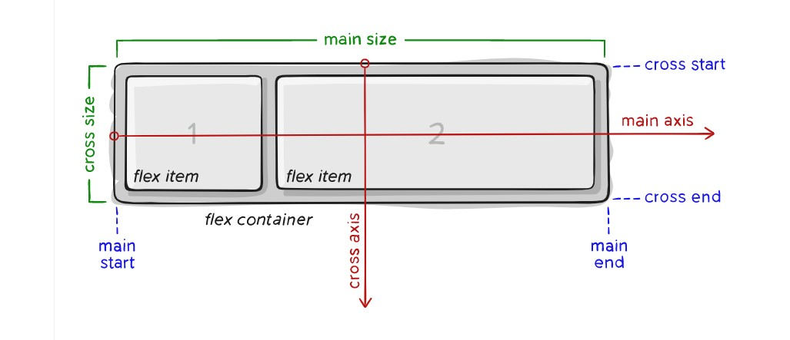
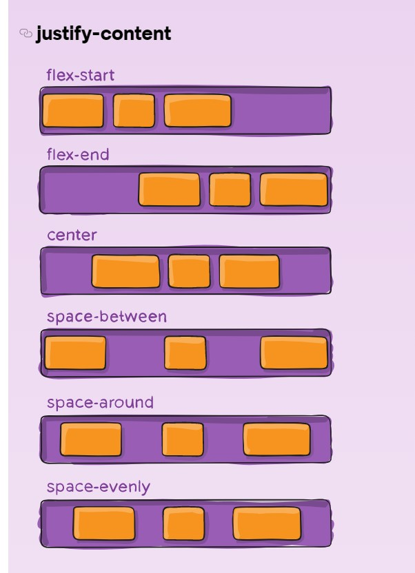
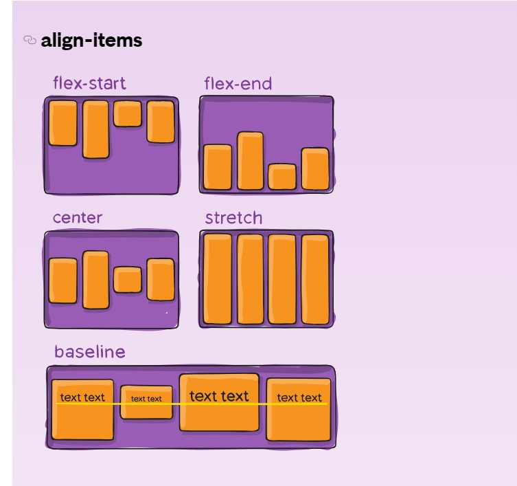
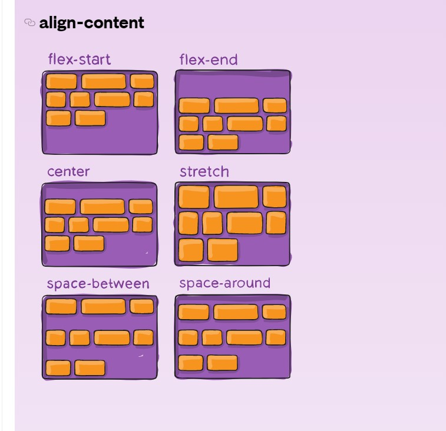

#### Terminology

##### flex layout დამოკიდებულია flex-flow-ს მიმართულებაზე.
##### აითემები ლაგდება main axis-ზე(main start-იდან main-end-მდე) ან cross-axis-ზე(cross-start-დან cross-end-მდე).

##### main-axis - არის კონტეინერის მთავარი აქსისი რომლის გასწვრივაც ლაგდება აითემები. ჰორიზონრალური იქნება თუ ვერტიკალური ეს დამოკიდებულია flex-direction ფროფერთიზე.
##### main-start|main-end - ფლექს აითემები კონტეინერში დალაგებულია main-startიდან main-end-მდე.
##### main-size - შეიძლება იყოს width ან height flex აითემის.
##### cross-axis - ქროს აქსისი პერპენდიკულარულია main-axis-ის ის დამოკიდებულია main-axis-ის მიმართულებაზე.
##### cross-start|cross-end - ქროს ხაზე მოთავზებულია კონტეინერში cross-startიდან cross-end-მდე.
##### cross-size -შეიძლება იყოს width ან height აითემის დამოკიდებულია cross აქსისის განზომილებაზე.

### Flexbox properties
### Properties For parent flex container

#### display: flex; - განსაზღვრავს ფლექს კონტეინერს.
#### flex-direction - ადგენს main-axis-ს და განსაზღვრავს მიმართულებას აიტემების. შეიძლება იყოს ვერტიკალური ან ჰორიზონტალური.
##### flex-direction: row | row-reverse | column | column-reverse;
##### row(default) - მარცხნიდან მარჯვნივ.
##### row-reverse - მარჯვნიდან მარცხნივ.
##### column - ზემოდან ქვემოთ.
##### column-reverse - ქვემოდან ზემოთ.

#### flex-wrap - დეფოლტად ფლექს ელემენტები ცდილობენ განლაგდნენ 1 ხაზზე, მაგრამ ჩვენ შეგვიძლია შევუცვალოთ პირობები
##### flex-wrap: nowrap | wrap | wrap-reverse;
##### nowrap(default) - ყველა აიტემი განლაგდება ერთ ხაზზე. 
##### wrap - განლაგდება რამდენიმე ხაზეე ზემოდან ქვემოთ. wrap-reverse - ქვემოდან ზემოთ.

#### flex-flow
##### flex-flow: column wrap; ეს არის shorthand ვერსია Flex-direction-ის და flex-wrap-ის. რომელიც ერთად განსაზღვრავს მთავარ და ქროს აქსისს default არის row nowrap.

#### justify-content

##### ეს განსაზღვრავს განლაგებას ძირითადი ღერძის გასწვრივ.
##### justify-content: flex-start | flex-end | center | space-between | space-around | space-evenly | start | end | left | right ... + safe | unsafe;
##### flex-start(default) - აიტემები შეფუთულია flex-მიმართულების დაწყებისთანავე.
##### flex-end - შეფუთულია ფლექს მიმართულების ბოლოში.
##### center - აიტემები არის განლაგებული ფლექს კონტეინერის ცენტრში.
##### space-between - აიტემები თანაბრად გადანაწილებულია ხაზში. პირველი აიტემი არის ხაზის დასაწყისში, ხოლო ბოლო აიტემი ხაზის ბოლოს.
##### space-around - აიტემები თანაბრადაა გადანაწილებული ხაზში და თითოეულ აიტემს აქვს ტოლი სივრცე გარშემო.
##### space-evenly - აითემები ისე ნაწილდება ზოლში, რომ თითოეულ ორ აითემს შორის და კიდეებზე თანაბარი სივრცეა.

#### align-items

##### - ეს განსაზღვრავს როგორაა განლაგებული აიტემები ქროს აქსისის გასწვრივ. მსგავსია ჯასთიფაი კონტენტის.
##### align-items: stretch | flex-start | flex-end | center | baseline | first baseline | last baseline | start | end | self-start | self-end + ... safe | unsafe;
##### stretch(default) - იჭიმება მთლიანი კკონტეინერის შესავსებად.
##### flex-start / start / self-start - განლაგებულია ქროს აქსისის დასაწყისში.
##### flex-end / end / self-end - აიტემები განლაგებულია ქროს აქსისის ბოლოში.
##### center - აიტემები განლაგებულია ცენტრში.
##### baseline - გასწორებულია მათი საწყისი ხაზების მიხედვით.

#### align-content

##### ეს ალაგებს ფლექს კონტეინერის ხაზებს როცა არის ზედმეტი თავისუფალი ადგილი ქროს აქსისზე, როგორც justify-content ალაგებს ინდივიდუალურ აოტემებს main-axis-ზე.
##### align-content: flex-start | flex-end | center | space-between | space-around | space-evenly | stretch | start | end | baseline | first baseline | last baseline + ... safe | unsafe;
##### normal - აიტემები განთავსებულია ნაგულისხმევი პოზიციის მიხედვით.
##### flex-start / start - აიტემები შეფუთულია კონტეინერის დასაწყისში. 
##### flex-end / end - აიტემები მოთავსებულია კონტეინერის ბოლოში.
##### center - ცენტრშია.
##### space-around - ხაზების გარშემო არის თანაბარი თავისუფალი ადგილი.
##### space-evenly - ხაზებს შორის სფეისები არის თანაბარი.
##### space-between - ხაზები თანაბრადაა განლაგებული. პირველი ხაზი არის კონტეინერის თავში მეორე - ბოლოში.
##### stretch - ხაზები იჭიმება დარჩენილი ადგილის დასაკავებლად.

#### gap, row-gap, column-gap

##### gap - თვისება პირდაპირ აკონტროლებს დაშორებას ფლექსის აიტემებს შორის. ის მხოლოდ აკონტროლებს ადგილს ატემებს შორის და არა კიდეებს შორის.
 
##### gap - gap არ იმუშავებს მაშინ როცა ადგილი აიტემებს შორის უფრო დიდია ვიდრე მითითებული gap. flex-ის რომელიმე ფროფერთის გამო როგორცაა justify-content: space-between.
