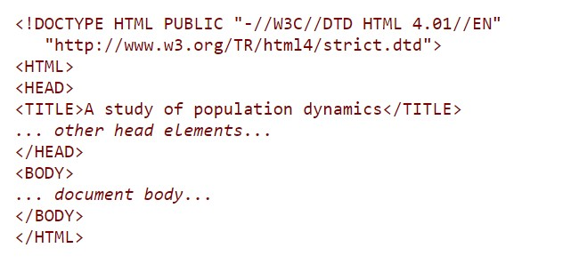
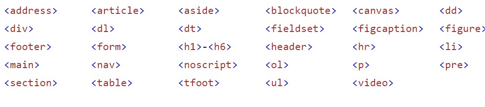
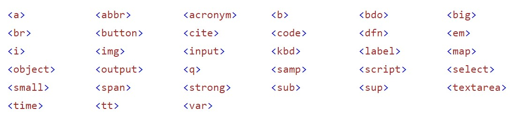
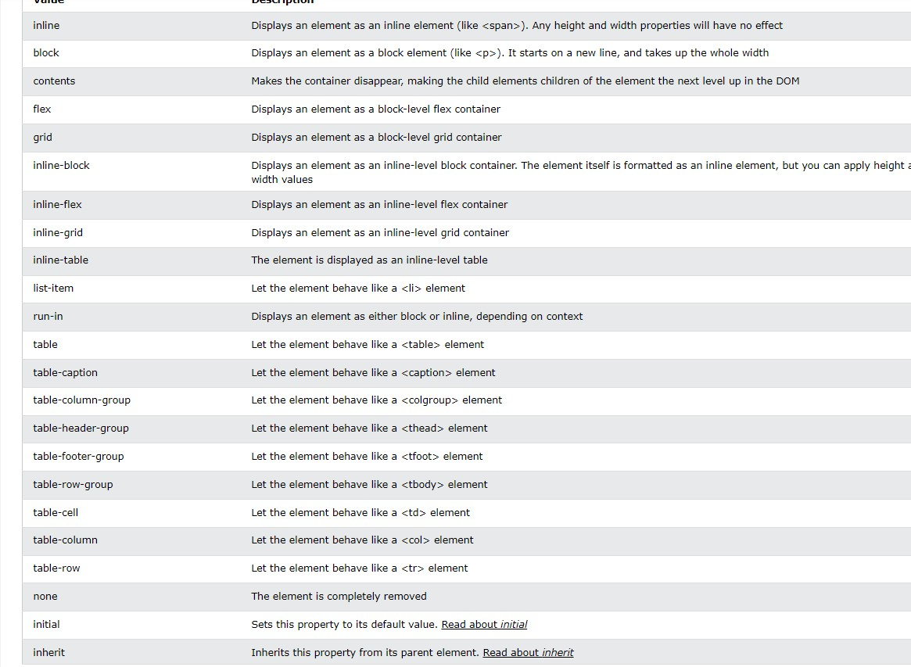

#### 1. Structure of HTML page

 

##### Doctype განსაზღვრავს დოკუმენტის ტიპს.
##### შემდეგ მოსდევს htlm თეგი, რომელიც შეგვიძლია დავწეროთ სურვილისამებრ, ის შეიძლება შეიცავდეს lang(ენა) ატრიბუტს.
##### head თეგში მოცემული გვაქვს meta მონაცემები(ლინკები და ა.შ).(title=სათაური, მოცემული tab-ში).
##### body თეგში მოცემული გვაქვს მთლიანი საიტის კონტენტი, რაც ჩანს ეკრანზე.

#### 2. Tags, icluding attributes
##### check out link [Html Tags](https://www.w3schools.com/tags/).

#### 3. Types of elements (block, inline, inline-block)

##### block level ელემეტი ყოველთვის იწყება ახალი ხაზიდან. ის ყოველთვის იღებს mთლიან სიგანეს რაც ხელმისაწვდომია(გადაჭიმული მარცხნიდან მარჯვნივ სადამდეც შესაძლებელია). block level ელემენტს აქვს მარჯინი ზემოდან და ქვემოდან რაც არ აქვს inline level ელემენტს.
##### block level ელემენტებია: 
##### 

##### inline level ელემენტი არ იწყება ახალი ხაზიდან, inline ელემენტი იღებს იმხელა სიგანეს რაც აუცილებელია. არ შეგვიძლია გავუწეროთ მარჯინი ტოპზე და ბოთთომზე. მას არ შეგვიძლია გავუწეროთ ასევე width და height.
##### inline level ელემენტებია:
##### 

##### inline-block  ელემენტს, inline-ისგან გასხვავებით შეგვიძლია გავუწეროთ width და height, ასევე margin/padding ტოპზე და ბოთთომზე.არ იწყება ახალი ხაზიდან. გამოიყენება navigation link-ების შესაქმნელად.

#### 4. Element positions and difference between them.

##### არსებობს 5 განსხვავებული პოზიცია (static, relative, fixed, absolute, sticky). პოზიცია იყენებს left, right, top და bottom ფროფერთიებს. სანამ პოზიციას არ გავუწერთ ელემენტს ამ ფროფერთიების გამოყენება არ შეგვეძლება.
##### position: static
##### სტატიკური პოზიცია ყველა html ელემენტს აქვს დეფოლტათ, მასზე არ მოქმედებს left, right, botto, top ფროფერთიები. იგი ყოველთვის პოზიციონირებულია ნორმალური ნაკადის მიხედვით.
##### position: relative
##### ელემენტი relative პოზიციით განლაგებულია მისი ნომრალური პოზიციის მიხედვით. მას შეგვიძლია გავუწეროთ top, left, right და bottom ფროფერთიები. ამ პოზიციას ვიყენებთ მაშინ როცა გვინდა მოვარგოთ child ელემენტი მოცემულ ელემენტს.
##### position: fixed
##### რელატიურია viewportის მიმართ. ის რჩება თავის ადგილას გვერდის სქროლისას.
##### position: absolute
##### ელემენტი ამ პოზიციით რელატიურია მშობლის მიმართ.
##### position: sticky
##### დამოკიდებულია იუზერისსქროლის პოზიციაზე. სტიკი პოზიცია რელატიურიდან გადადის fixed პოზიციაში, დამოკიდებულია სქროლის პოზიციაზე. ელემეტი რელატიურია სანამ კიდე ხვდება ვიუპორტს, შემდეგ კი გადადის fixed პოზიციაში. და რჩება დოკუმენტის თავში.

#### 5. Display of elements
