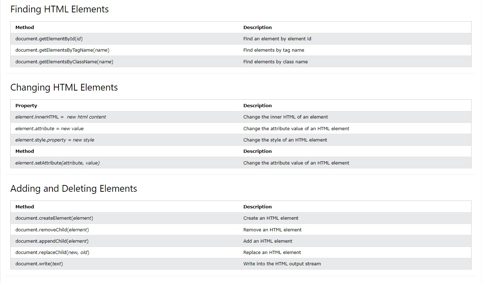

### 12. DOM
#### HTML DOM მეთოდი არის  აქტივობა რომელიც შეგიძლია შესარულო HTML ელემენტზე.
#### DOM ფოფერთი არის მნიშვნელობა რომელი შეგიძლია გაუწერო ელემენტს ან შეცვალო.

### The getElementById Method
#### ყველაზე გავრცელებული მეთოდია, რომლითაც შეგვიძლია html ელემენტს მივწვდეთ აიდის მეშვეობით.
#### document.getElementById("demo").innerHTML = "Hello World!";
#### ზემოთ მაგალითში getelementbyid იყენებს id = "demo" ელემენტზე წვდომისთვის.

### The innerHTML Property
####  ყველაზე მარტივი გზა, ელემენტის კონტენტის მისაღებად არის გამოვიყენოთ innerHTML ფროფერთი.
####  ის ასევე გამოიყენება html ელემენტის კონტენტის შესაცვლელად.

### Adding Events Handlers

#### document.getElementById(id).onclick = function(){code}	Adding event handler code to an onclick event

### finding elements
#### const element = document.getElementById("intro"); თუ ვერ იპოვნის null-ს დააბრუნებს
#### const element = document.getElementsByTagName("p"); იპოვნის ყველა 
 ტეგს.
#### const x = document.getElementsByClassName("intro"); ყველა ელემენტს დააბრუნებს რასაც ეს კლასიაქვს.
#### const x = document.querySelectorAll("p.intro"); დააბრუნებს ლისტს იმ p სელექტორების, რომლებსაც აქვთ inro კლასი.

### eventLIstener
#### document.getElementById("myBtn").addEventListener("click", displayDate);

#### ჩვენ შეგვიძლია რამდენიმე ევენთ ჰენდლერი დავამატოთ ერთ ელემენტს მაგრამ ივენთ ლისენერი მხოლოდ ერთხელ შეგვიძლია.
#### element.removeEventListener("mousemove", myFunction); შლის eventlistener-ს.