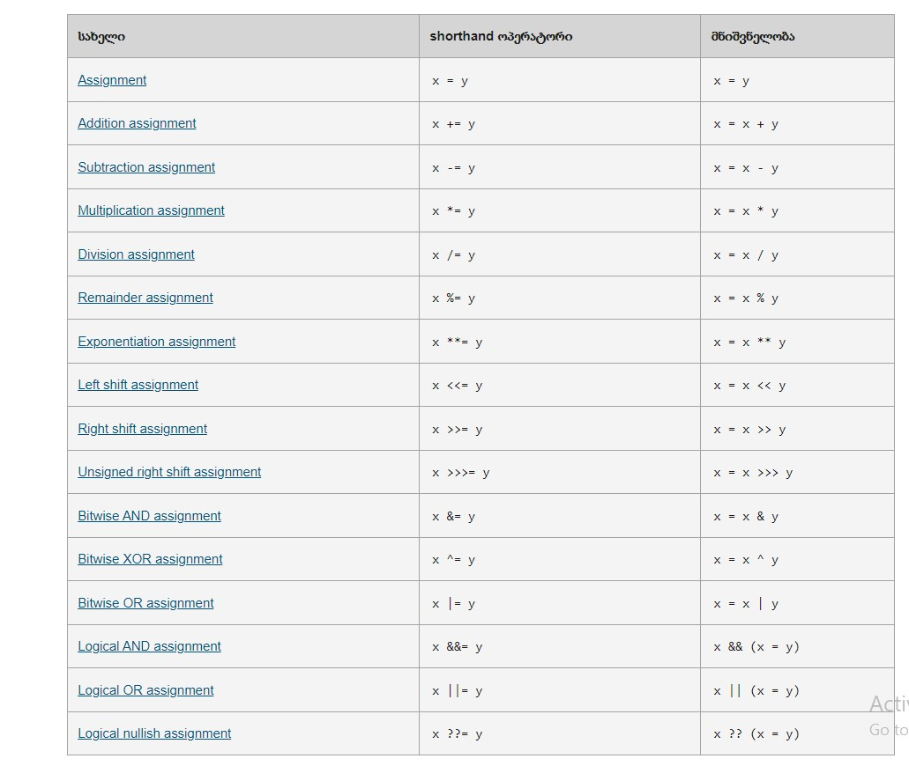
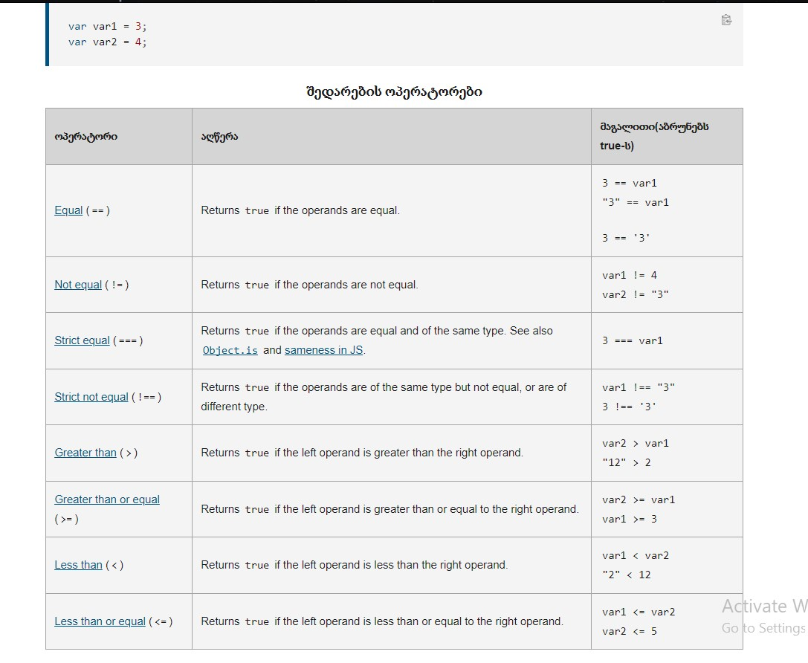
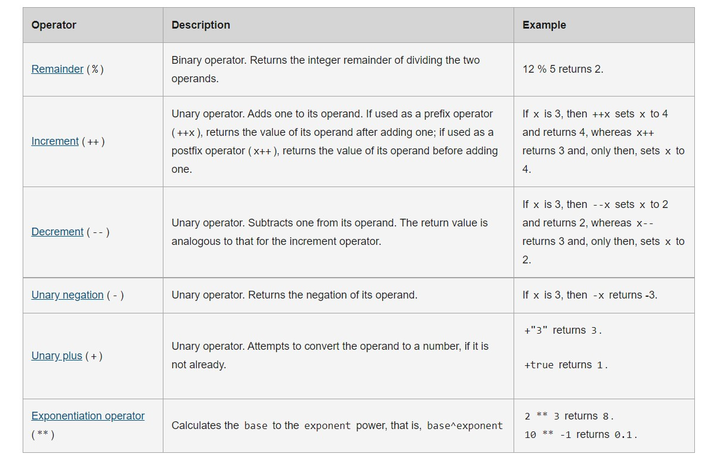
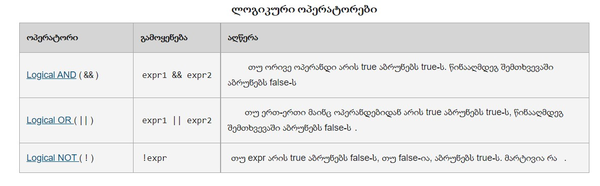
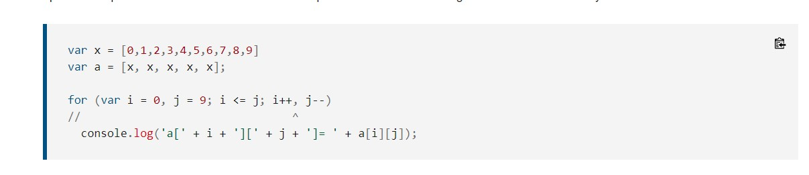
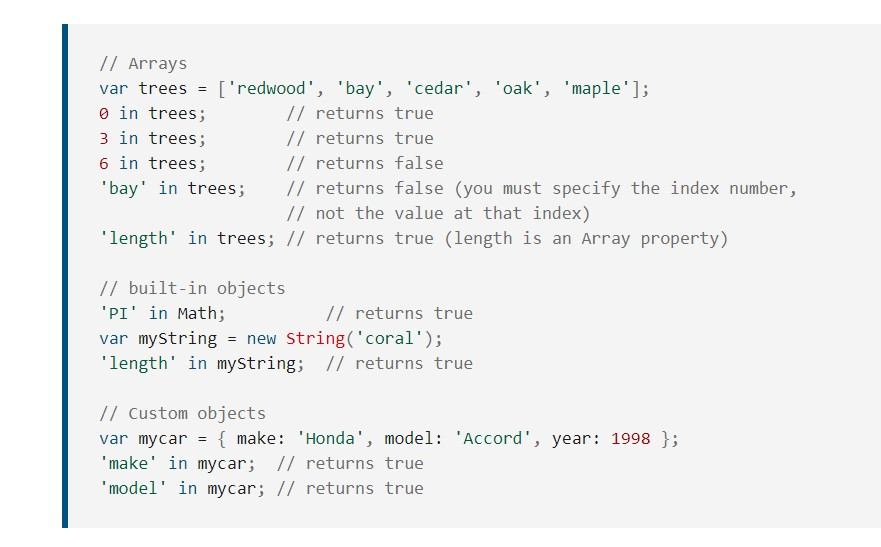
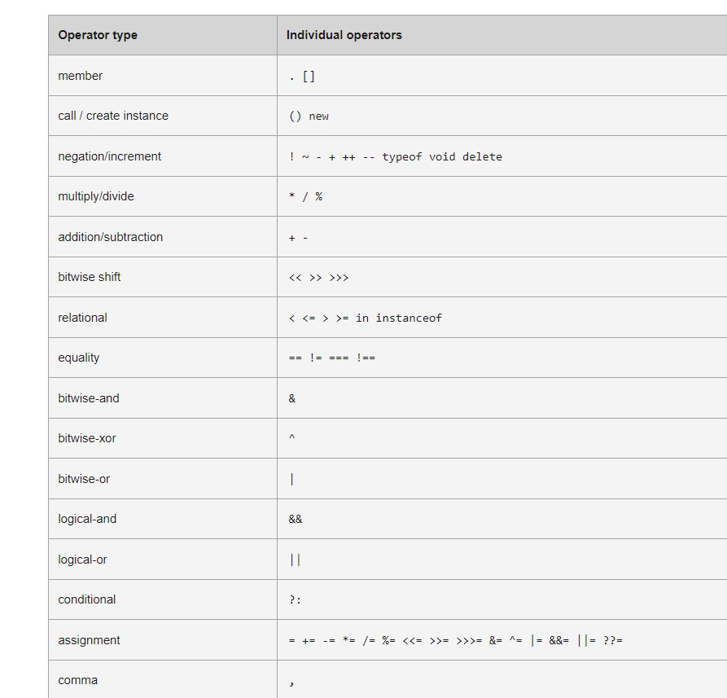

### 3. Operators

#### ჯავასკროპტს აქვს მომდევნო ოპერატორები:

##### Assignment operators

##### COMPARISON OPERATORS

##### ARITHMETIC OPERATORS

##### BITWISE OPERATORS

##### LOGICAL OPERATORS

##### STRING OPERATORS

##### CONDITIONAL (TERNARY) OPERATOR

##### COMMA OPERATOR

##### UNARY OPERATORS

##### RELATIONAL OPERATORS

##### ჯავასკრიპტს აქვს ორივე binary და unary ოპერატორი, და ერთი განსაკუთრებული ternary ოპერატორი, პირობითი ოპერატორი.

##### binary ოპერატორი მოითხოვს ორ ოპერანდს ოპეარტორის წინ და შემდეგ.

##### operand1 operator operand2. მაგალითად, 3+4 or x\*y

##### unary ოპერატორი მოითხოვს ერთ ოპერანდს, ოპერატორის წინ ან შემდეგ.

##### operator operand. ან operand operator. მაგალითად x++ ან ++x.

##### Assignment operators

##### მინიჭების ოპერატორი ანიჭებს მნიშვნელობას მარცხენა ოპერანდ მარჯვენა ველიუდან გამომდინარე.

##### ყველაზე მარტივი მინიჭების ოპერატორია "=".(x = y) რომელიც მარცხენა ოპერანდს უტოლებს მარჯვენა ოპერანდს. x = y იგივეა რაც y = x.

##### ამის გარდა გვაქვს კიდევ ბევრი მინიჭების ოპერატორი. მოცემულია table-ში.

#### Destructuring

##### var foo = ['one', 'two', 'three'];

##### without destructuring

##### var one = foo[0];

##### var two = foo[1];

##### var three = foo[2];

##### with destructuring

##### [one, two, three] = foo;

#### Comparison(შედარების) ოპერატორები.

##### შედარების ოპერატორი ადარებს ერთმანეთს ოპერანდებს, და აბრუნებს ლოგიკურ ველიუს რომელიც დამოკიდებულია იმაზე თუ სად არის შედარება true.

##### operand-ები შეიძლება იყოს ნებისმიერი ტიპის.

##### Note: => is not an operator, but the notation for Arrow functions.

#### Arithmetic (არითმეტიკული) ოპერატორები.

##### არითმეტიკული ოპერატორი იღებს რიცხვით მნიშვნელობას და აბრუნებს ერთიან რიცხვით მნიშვნელობას.

##### სტანდარტული არითმეტიკული ოპერატორებია: მიმატება(+), გამოკლება(-), გაყოფა(/), გამრავლება(\*).

##### არსებობს სხვა არითმეტიკული ოპერატორები, რომლებიც მოცემულია ფოტოში.

#### Logical(ლოგიკური) operators

##### ლოგიკური ოპერატორები გამოყენებულია Boolean(ლოგიკურ) მნიშველობებთან.

#### String Operators

##### დამატებით, შედარების ოპერატორები რომლებიც შეგვიძლია გამოვიყენოთ სტრინგებთან, არრის concatanation ოპერატორი(შეერთების ოპერატორი).

##### ის აერთებს ორ სტრინგს ერთმანეთთა, და აბრუნებს ახალ გაერთიანებულ სტრინგს.

##### მაგალითად: console.log('my ' + 'string'); // console logs the string "my string".

##### შორთჰენდ ოპერატორი ასევე გამოიყენება იგივე მოქმედების შესასრულებლად (+=).

##### მაგალითად:

##### var mystring = 'alpha';

##### mystring += 'bet'; // evaluates to "alphabet" and assigns this value to mystring.

#### Conditional(ternary) Operator - პირობითი ოპერატორი.

##### პირობითი ოპერატორი არის ჯავასკრიპტის ოპერატორი რომელიც იღებს სამ ოპერანდს. ოპერატორს შეიძლება ჰქონდეს 1 ან ორი ვალიუ, დამოკიდებულია პირობაზე.

##### სინტაქსია:

#### condition ? val1 : val2

##### თუ პირობა არის true, ოპერატორის ველიუ იქნება val1, წინააღმდეგ შემთხვევაში val2.

##### ქონდიშენალ ოპერატორი შეგვიძლია გამოვიყენოთ ყველგან სადაც ვიყენებთ სტანდარტულ ოპერატორს.

#### var status = (age >= 18) ? 'adult' : 'minor';

##### თუ ასაკი მეტი ან ტოლია 18ზე, ველიუ იქნება 'adult', წინააღმდეგ შემთხვევაში 'minor'.

#### Comma Operator

##### მძიმის(,) ოპერატორი ასრულებს ორივე ოპერანს და აბრუნებს ბოლო ოპერანდის მნიშვნელობას. ეს ოპერატორი პირველ რიგში გამოიყენება for loop-ში.

##### ნებას რთავს რამდენიმერ ოპერანდს დააფდეითდეს ერთდროულად ლუპში. მაგრამ best practise-ია. და ჯობს ორი განცალკევებული სთეითმენთი გამოვიყენოთ.

##### მაგალითად: თუ a არის ორგანზომილებიანი მასივი, შემდეგი კოდი იყენებს comma ოპერატორს, რომ დააფდეითოს ორი ცვლადი ერთდროულად.

##### კოდი ამოპრინტავს ველიუებს იმ ელემენტების რომლებიც იქნება დიაგონალზე მასივში.

#### Unary Operator

##### უნარი ოპერაცია ხდება მხოლოდ ერთი ოპერანდით.

#### delete

##### delete ოპერატორი შლის ობიექტის ფროფერთის. სინტაქსი შემდეგია:

##### delete object.property;

##### delete object[propertyKey];

##### delete objectName[index];

##### delete ოპერატორი აბრუნებს True-ს თუ ოპერაცია შესაძლებელია, წინააღმდეგ შემთხვევაში კი false-ს.

#### typeof operator
##### typeof operand
##### typeof (operand) ---- აბრუნებს ოპრანდის ტიპს. 
##### typeof true; // returns "boolean"
##### typeof null; // returns "object"

#### void operator
##### აქვს შემდეგი სინტაქსი
##### void (expression)
##### void expression
##### void ოპერატორის განსაზღვრავს ექსფრეშენსი შესრულებას return value-ს გარეშე. ფრჩხილებით არის საუკეთესო პრაქტიკა.

#### Relational operators(რელატიური ოპერატორები)
##### რელატიური ოპერატორი ადარებს ერთმანეთს ოპერანდებს და აბრუნებს ბულიან(ლოგიკურ) ველიუს იმის მიხედვით შედარება არის თუ არა True.

#### in 
##### in ოპერატორი აბრუნებს True-ს თუ მითითებული ფროფერთი არსებობს მითითებულ ობიექტში. 
##### სინტაქსია
##### propNameOrNumber in objectName
##### სადაც propNameorNumber შეიძლება იყოს რიცხვითი, სტრინგი ან სიმბოლო, წარმოდგენილი ფროფერთის სახელით ან მასივის ინდექსით. objectName არის ობიექტის სახელი.

#### instanceof
##### ეს ოპერატორი აბრუნებს True-ს თუ მითითებული ობიექტი არის მითითებული ობიექტის ტიპი.
##### objectName instanceof objectType
#### var theDay = new Date(1995, 12, 17);
#### if (theDay instanceof Date) {
####  // statements to execute
#### }

#### precedence operator(უპირატესი ოპერატორი)
##### preceddence ოპერატორი განსაზღვრავს ოპერაციების თანმიმდევრობას ექსპრეშენის შესრულებისას. ჩვენ შეგვიძლია გადავაწეროთ უპირატესი ოპერატორი ფრჩხილების გამოყენებით.
##### precedence ოპრატორები highest level-იდან ქვემოთ:

