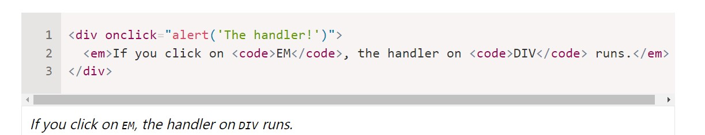
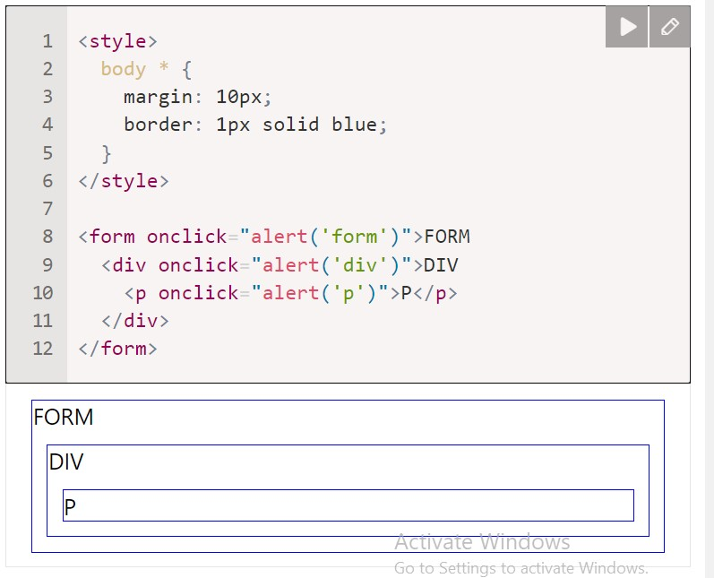
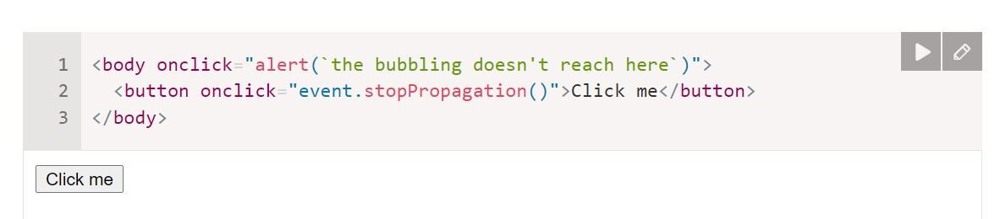
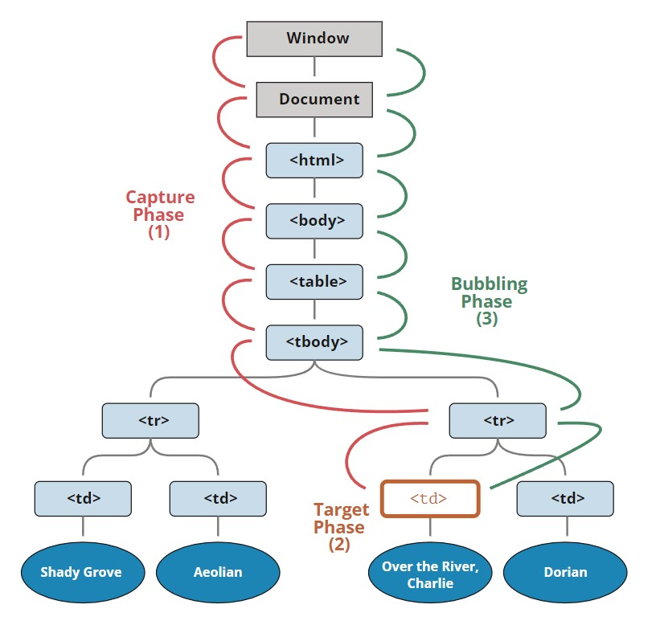
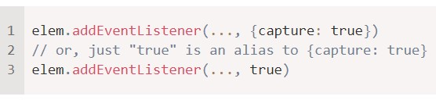

# Bubbling and capturing 
### Let's starts with an example.
### This handler is assigned to < div > but also runs if you click any nested tag like < em > or < code >:
### if you click on em, the handler on div runs

## Bubbling
### The bubbling principle is simple
### When an event happens on an element, it first runs the handlers on it, then on its parent, then all the way up on other acestors.
### Let's say we have 3 nested elements FORM > DIV > P with a handler on each of them:

### A click on the inner < p > first runs onclick:
### 1. On that < p > . 2. < div > 3. < form > 4. And so on upwards till the document object.
### So if we click on < p >, then we'll see 3 alerts p -> div -> form

## event.target
### A handler on a parent element can always get the details about where it actually happened.
### The most deeply nested element that caused the event is called a target element, accessible as event.target.
### Note the differences from this = (event.currentTarget):
### event.target - is the "target" element that initiated the event, it doesn't change trough the bubbling process.
### this - is the "current" element, the one that has a currently running handler on it.

### For instance, if we have a single handler from.onclick, then it can "catch" click inside the form. No matter where the click happened, it bubbles up to < form > and runs the handler.
### In form.onclick handler:
### this (= event.currentTarget) is the < form > element, because the handler runs on it.
### event.target is the actual element inside the form that was clicked.
### Check it out: [bubbling](https://javascript.info/article/bubbling-and-capturing/bubble-target/)
### It's possible that event.target could equal this - it happens when the click is made directly on the < form > element.

## Stopping bubbling
### A bubbling event goes from the target element straight up. Normally it goes upwards till < html >, and then to document object, and some events even reach window, calling all handlers on the path.
### But any handler may decide that the event has been fully processed and stop the bubbling.
### The method for it is event.stopPropagation()
### For instance here body.onclick doesn't work if you click on < button >:

## event.stopImmediatePropagation()
### If an elements has multiple event handlers on a single event, then even if one of the stops the bubbling, the other ones still execute.
### In other words, event.stopPropagation() stops the move upwards, but on the current element all other handlers will run.
### To stop the bubbling and prevent handlers on the current element from running, there's a method event.stopImmediatePropagation(). After it no other handlers execute.

## Don't stop bubbling without a need.
### Bubbling is covenient. Don't stop it without a real need: obvious and architecturally well thought out.
### Sometimes event.stopPropagation() creates hidden pitfalls that later may become problems.

## Capturing
### There's another phase of event processing called "capturing". It is rarely used in real code, but sometimes can be useful.
### The standard DOM events describes 3 phases of event propagation:
### 1. capturing phase - the event goes down to the element
### 2. Target phase - the event reached the target element
### 3. Bubbling phase - the event bubbles up from the element
### Here's the picture of a click on < td > inside a table:

### That is: for a click on < td >  the event first goes trought the ancestors chain down to the element(capturing phase)
### then it reaches the target and triggers there(target phase), and then it goes up(bubbling phase), calling handlers on its way.

### Before we only talked about bubbling, because the capturing phase is rarely used. Normally it is invisible to us.
### Handlers added using on < event > - property or using HTML attributes or using two-argument addEventListener(event, handler) don't know anything about capturing, they only run on 2nd and 3rd phases.

To catch an event on the capturing phase, we need to set the handler
 <strong>capture</strong> option true:
 

 

 
There are two possible values of the capture option

 
 If it's false(default), then the handler is set on the bubbling phase
 
If it's true, then the handler is set on the capturing phase 

Note that while formally there are 3 phases, the 2nd phase("target phase": the event rached the element) 
is not handled separately: handlers on both capturing and bubbling phases trigger at that phase

Let's see both capturing and bubbling in action

<a href="https://plnkr.co/edit/?p=preview"> check it out </a>

The code sets click handlers on every element in the document  

There's property event.eventPhase that tells us the number of the phase on which the event was caught

To remove the handler, removeEventListener needs the same phase 

If we addEventListener(..., true), then we should mention the same phase in removeEventListener(..., true) to correctly remove the handler. 

Listeners on same element and same phase run in their set order

If we have multiple event handlers on the same phase, assigned to the same element with addEventListener, they run in the same order as they are created
:
