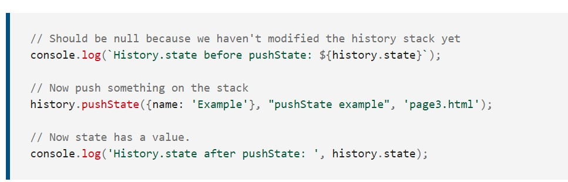

# History.state
### The History.state property returns a value representing the state at the top of history stack.
### This is a way to look at the state without having to wait for a popstate event.
### const currentState = history.state
## Value
### The state at the top of the history stack. The value is null() until the pushState() or replaceState() method is used.

## Examples
### The code below logs the value of history.state before using the pushState() method to push a value to the history.
### The next line logs the value to the console again, showing that history.state now has a value.

### The popstate event of the Window interface is fired when the active history entry changes while the user navigates the session history. It changes the current history entry to that of the last page the user visited or, if history.pushState() has been used to add a history entry to the history stack, that history entry is used instead.